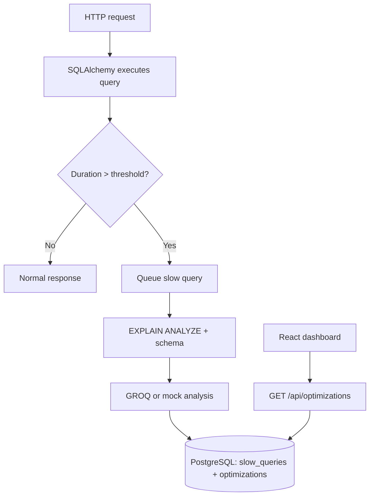

# AI-Powered Database Query Optimizer

FastAPI app that monitors PostgreSQL queries via SQLAlchemy, flags slow queries (default **500ms**), runs `EXPLAIN ANALYZE`, sends context to GROQ for suggestions, and shows results in a React dashboard.

## Flow



## Prerequisites

- Python 3.11+
- PostgreSQL (database `data` with a `data` table — see `models/user.py`)
- Node.js 18+ (dashboard)
- GROQ API key (optional — mock analysis runs without it)

## Setup

1. Virtual environment and dependencies:

```bash
python -m venv .venv
.venv\Scripts\activate
pip install -r requirements.txt
```

2. Environment:

```bash
copy .env.example .env
```

Edit `DATABASE_URL` and optionally `GROQ_API_KEY`. See `.env.example` for all settings.

3. Start the API:

```bash
python main.py
```

API: http://127.0.0.1:8000

4. Start the dashboard (separate terminal):

```bash
cd frontend
npm install
npm run dev
```

UI: http://localhost:5173

## Demo

Trigger a slow query (~550ms via `pg_sleep`):

```bash
curl http://127.0.0.1:8000/users/slow-search
```

Or use **Simulate slow query** in the dashboard. After a few seconds, check the list or:

```bash
curl http://127.0.0.1:8000/api/optimizations
```

## API

| Method | Path | Description |
|--------|------|-------------|
| GET | `/health` | API status and `slow_threshold_ms` |
| GET | `/users/{email}` | Lookup row in `data` table |
| GET | `/users/slow-search` | Demo endpoint that triggers slow-query pipeline |
| GET | `/api/optimizations` | List optimizations (`?sort=priority\|confidence\|created_at`) |
| GET | `/api/optimizations/{id}` | Detail with SQL, indexes, confidence |
| PATCH | `/api/optimizations/{id}` | Update status (`pending`, `dismissed`, `reviewed`) |
| POST | `/api/optimizations/analyze` | Manually queue analysis |

## Project layout

```
main.py                 # FastAPI app, demo routes, slow-query drain
middleware/             # SQLAlchemy query timing
routers/                # Optimization REST API
services/               # EXPLAIN, GROQ, parser, analyzer
models/                 # User data + optimization records
frontend/               # Vite + React dashboard
tests/
```

## Tests

```bash
pip install pytest
pytest
```

## Security

- Only `SELECT` queries are analyzed
- Index DDL is suggested only (not applied automatically)
- Do not commit `.env` with real credentials
